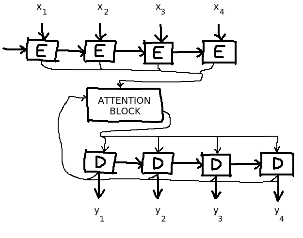
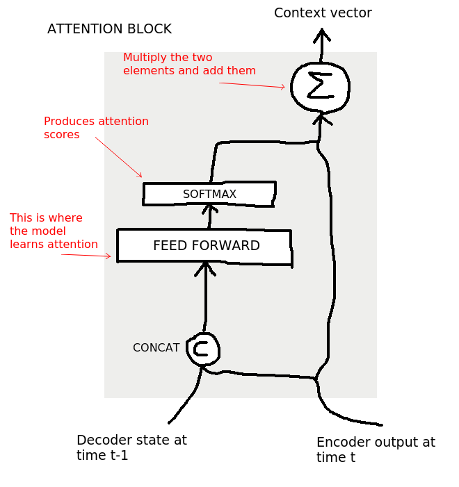
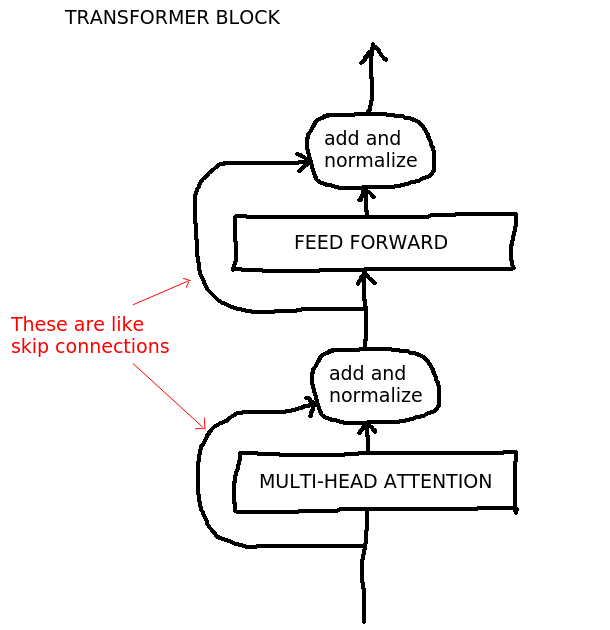

# An Overview of Attention Mechanisms in Neural Networks

Summary:

- Limits of vanilla seq2seq models
- Additive attention
- Multiplicative attention
- Self-attention
- Other mentions
- Sources

<br/>

Attention in Deep Learning is one of the most powerful and interesting tools of the last years.
It revolutionized the implementation and the application of seq2seq architectures, and consequently the whole field of NLP.

One of the most fascinating aspects of attention mechanisms is a strong biological analogy, i.e. the way it works is very similar to the way we usually thing about our own attention.
In fact, we can think of it as some sort of "mental heatmap" in which the most important elements of our empirical input are fired up, to the detriment of its less relevant bits. 
The whole point of attention mechanisms is just that: let’s teach artificial neural networks to understand what elements of its input it should care about the most, and what others instead can be overlooked.

<br/>


## Limits of “vanilla” Seq2seq models

Current attention mechanisms come from research on Seq2seq networks, which goal is to transform an input sequence into another (sorry for oversimplifying, but I don’t want to waste your time). 
They are constituted of an Encoder generating a representation of the input sequence, and a Decoder that receives it and produces another sequence as output. 
Before the rise of Transformer networks, Seq2seq models use to be the SOTA in important fields of Deep Learning such as NMT, chatbots, text summarization and image captioning.

Their problems are well known: *they struggle to process long sequences*.

Imagine a typical seq2seq model with LSTM layers:

<div>
  
</div>

Assume a very relevant bit of information is located far away in the input sequence (let’s say at the very beginning of it). 
The Encoder should generate a representation of the whole input in a single vector, making it very hard for that signal to traverse intact all LSTM cells and reach the layer output. 
That’s why “vanilla” Seq2seq struggle in translating long pieces of text. 
(The introduction of bidirectional Recurrent layers improved significantly the performance of RNNs, but it alleviated the problem rather than solving it.)

Moreover, it’s not how we translate things. 
Imagine someone told you to translate an article from Italian to English: you don’t read the whole text, memorize it, and then say: “Got it! Let me write it all down in English!”. 
That’t not how we do. Rather, we’d constantly check the original and the translation, jumping from one to the other countless times. 

That’s what attention mechanisms is meant to accomplish.

In this post I will review the three main kinds of attention mechanism:
- Additive attention
- Multiplicative attention
- Self-attention

I will explain how they work, and how attention layers can be quickly called or implemented in TensorFlow 2.x.

<br/>


##  Additive attention

It’s the first successful formulation of attention mechanism, proposed by **Bahdanau et al.** in 2014.
That’s what they did: in a Seq2seq model, between the Encoder and Decoder, the added an **Attention block**: 
nothing more than a simple feed forward layer that, for each of the steps produced by the Decoder, learns how to distribute attention on the outputs of the Encoder.

<div>
  
</div>

Although it seems significantly more complicated than before, there is only one difference.
Between Encoder and Decoder we now have an "Attention block" that at each time step t receives to inputs: the Encoder's output at t, and the Decoder's state at t-1.
These are the elements that the Attention block needs to produce the Decoder's input at t.

More closely, it works like this:

<div>
  
</div>

As shown in the picture, at each step the Decoder can "choose what to look at" more by combining together its previous hidden state and the current Encoder output. 
The term "additive" comes from this.

Attention allows the Decoder to look at the same time to multiple steps of Encoder sequence, even far back in time. 
In a way, the Attention mechanism plays a role not too different from the one that is played by skip connections in CNNs. 
It represents a "shortcut" for any useful signal present in the input sequence, that doesn’t have to traverse all the layer cells before affecting the output.

Since **TensorFlow 2.1**, Bahdanau attention is already available among `keras.layers` as `AdditiveAttention()`. It requires two inputs \[EXPLANATION\]

<br/>


## Multiplicative attention

L’attenzione moltiplicativa è stata proposta da Luong et al poco dopo la formulazione additiva.

Miglioramento da parte di Luong et al.
In realtà, non ne è stato proposto un solo tipo, ma diversi: [elenco]

[spiega I vantaggi dell’attenzione moltiplicativa presi da Géron]

The difference from Bahdanau Attention is in how the Encoder outputs and the Decoder's previous hidden states are combined.
In this case, Attention is computed as a *dot product* of these two elements.

Another advantage is that this operation is computationally much faster, compared to Additive Attention.

Today, Multiplicative Attention is considered superior to its additive couterpart.
In everyday's work, generally talking about "attention" means Luong's.


In fact, not one but three Multiplicative attentions have been proposed:
- make
- list
- formulae

Multiplicative Attention was proved superior in performance, while allowing for faster training at the same time.
Because of this, this formulation of Attention is now considered the standard for Seq2seq implementations, and when we generically refer to "Attention" we mean Luong at al.'s.

In **TensorFlow 2**, Multiplicative Attention is implemented in `keras.layers` as `Attention()` and follows exactly the same syntax of `AdditiveAttention()`.

<br/>


## Self-attention

Since its first applications, attentional models have been so successful to push a group of researchers at Google Brain \[Vaswani et al. 2018\] to abandon LSTM and GRU technology 
and invent a new kind of neural architecture based exclusively on Attention mechanisms.

That was the birth of the **Transformer**.

This architecture has an Encoder and a Decoder, each composed of an optional number of blocks that look more or less like this:

<div>
  
</div>

The Transformer is more complex than previous Seq2seq models (IMHO), and to describe it in detail a whole new blog post would be necessary (actually, I’m thinking of it). 
In the meantime, I strongly suggest you to read the excellent post The Illustrated Transformer by Jay Alamar, a *must read* article on this topic.

What is most interesting here is to explore the **Self-attention** mechanism, proposed specifically for this new architecture.

Previous attention mechanisms are all relative, i.e. a Decoder learns to produce an output sequence while paying attention to another sequence (produced by the Encoder). 
The intuition at the basis of Self-attention instead is: let’s teach a Neural Network (or better, a part of it) to pay attention to its most important input parts. 
In this case, the *input sequence pays attention to itself*.

\[ Formula \]

This formulation is also called **Scaled Dot-product Attention**.
This name comes from 

Another important aspect is that the Transformer doesn't simply uses *one* Attention mechanism, it runs many in parallel (in the original paper, eight).
That's what the authors called "Multi-Head Attention".
The logic behind implementing multiple, identical Self-attention mechanisms in parallel is that in this way the Network can use different mechanisms to pay attention at different thins at the same time.

Even though Self-attention seems strictly connected with Trasformer Networks (and it is), it could in theory be applied to other architectures as well, such as CNNs and RNNs. 
It has been used in GANs, for example \[\].


TensorFlow 2 does not contain a built-in Self-attention layer (yet?), but it is possible to implement it, and there is more than one way to do it.
For example, if you just want to implement a bare self-attention mechanism (i.e. an Attention layer in which "the input pays attention to itself") then you can simply use an `Attention()` layer and feed the same input tensor `X` twice:

```
from tensorflow.keras.layers import Attention

self_attention = Attention(use_scale=True)([X, X])
```

This will return a very basic Self-Attention scores that you can use not necessarily with Transformers.
Notice the argument `use_scale=True`: it works similarly to the scaling factor used in Scaled Dot-Product Attention, but it's not the same.
In Transformer architectures this scaling factor is in fact constant, while in this case it is governed by a learnable parameter.

Let's assume you want to implement the exactly the same Attention mechanism used in Transformer Networks; on the TensorFlow website a whole implementation is available. 
First, we have this function implements **scaled dot-product attention**:

```
def scaled_dot_product_attention(q, k, v, mask):
    """Calculate the attention weights.
    q, k, v must have matching leading dimensions.
    k, v must have matching penultimate dimension, i.e.: seq_len_k = seq_len_v.
    The mask has different shapes depending on its type(padding or look ahead) 
    but it must be broadcastable for addition.

    Args:
    q: query shape == (..., seq_len_q, depth)
    k: key shape == (..., seq_len_k, depth)
    v: value shape == (..., seq_len_v, depth_v)
    mask: Float tensor with shape broadcastable 
          to (..., seq_len_q, seq_len_k). Defaults to None.

    Returns:
    output, attention_weights
    """

    matmul_qk = tf.matmul(q, k, transpose_b=True)  # (..., seq_len_q, seq_len_k)

    # scale matmul_qk
    dk = tf.cast(tf.shape(k)[-1], tf.float32)
    scaled_attention_logits = matmul_qk / tf.math.sqrt(dk)

    # add the mask to the scaled tensor.
    if mask is not None: 
        scaled_attention_logits += (mask * -1e9)  

    # softmax is normalized on the last axis (seq_len_k) so that the scores
    # add up to 1.
    attention_weights = tf.nn.softmax(scaled_attention_logits, axis=-1)  # (..., seq_len_q, seq_len_k)

    output = tf.matmul(attention_weights, v)  # (..., seq_len_q, depth_v)

    return output, attention_weights
```

Second, a new **Self-Attention layer** can be then implemented:

```
class MultiHeadAttention(tf.keras.layers.Layer):
    def __init__(self, d_model, num_heads):
        super(MultiHeadAttention, self).__init__()
        self.num_heads = num_heads
        self.d_model = d_model
        
        assert d_model % self.num_heads == 0
        
        self.depth = d_model // self.num_heads
        
        self.wq = tf.keras.layers.Dense(d_model)
        self.wk = tf.keras.layers.Dense(d_model)
        self.wv = tf.keras.layers.Dense(d_model)
        
        self.dense = tf.keras.layers.Dense(d_model)
        
    def split_heads(self, x, batch_size):
        """Split the last dimension into (num_heads, depth).
        Transpose the result such that the shape is (batch_size, num_heads, seq_len, depth)
        """
        x = tf.reshape(x, (batch_size, -1, self.num_heads, self.depth))
        return tf.transpose(x, perm=[0, 2, 1, 3])
    
    def call(self, v, k, q, mask):
        batch_size = tf.shape(q)[0]
        
        q = self.wq(q)  # (batch_size, seq_len, d_model)
        k = self.wk(k)  # (batch_size, seq_len, d_model)
        v = self.wv(v)  # (batch_size, seq_len, d_model)
        
        q = self.split_heads(q, batch_size)  # (batch_size, num_heads, seq_len_q, depth)
        k = self.split_heads(k, batch_size)  # (batch_size, num_heads, seq_len_k, depth)
        v = self.split_heads(v, batch_size)  # (batch_size, num_heads, seq_len_v, depth)
        
        # scaled_attention.shape == (batch_size, num_heads, seq_len_q, depth)
        # attention_weights.shape == (batch_size, num_heads, seq_len_q, seq_len_k)
        scaled_attention, attention_weights = scaled_dot_product_attention(q, k, v, mask)
    
    scaled_attention = tf.transpose(scaled_attention, perm=[0, 2, 1, 3])  # (batch_size, seq_len_q, num_heads, depth)

    concat_attention = tf.reshape(scaled_attention, 
                                  (batch_size, -1, self.d_model))  # (batch_size, seq_len_q, d_model)

    output = self.dense(concat_attention)  # (batch_size, seq_len_q, d_model)
        
    return output, attention_weights
```

This will work just like any other Keras layer.

<br/>


## Quick conclusion

Attention is one of the most exciting developments in the fiels of Deep Learning, and the rise of Transformers is a proof of their absolute importance.
There are many formulations of Attention that I overlooked because of a lack of space.
One notable mention is the difference between **Local** and **Global Attention**, where one is confined to a given time window in the input sequence, while the other
Again, choosing between the two is another trade off between computational costs and.

Countless formulations of Attention mechanism have been invented since 2014.
Somebody tried using Convolutional layers in the Attention block.
Someone else


<br/>


## Sources
- [Bahdanau, D., Cho, K., & Bengio, Y. (2014). Neural machine translation by jointly learning to align and translate. arXiv preprint arXiv:1409.0473](https://arxiv.org/abs/1409.0473).
- [Géron, A. (2019). Hands-on machine learning with Scikit-Learn, Keras, and TensorFlow: Concepts, tools, and techniques to build intelligent systems. O'Reilly Media](https://www.oreilly.com/library/view/hands-on-machine-learning/9781492032632/); particularly Chapter 16, *Natural Language Processing with RNNs and Attention*.
- [Luong, M. T., Pham, H., & Manning, C. D. (2015). Effective approaches to attention-based neural machine translation. arXiv preprint arXiv:1508.04025](https://arxiv.org/abs/1508.04025).
- [The Illustrated Transformer](http://jalammar.github.io/illustrated-transformer/) by [Jay Alammar](http://jalammar.github.io/).
- [Vaswani, A., Shazeer, N., Parmar, N., Uszkoreit, J., Jones, L., Gomez, A. N., ... & Polosukhin, I. (2017). Attention is all you need. In Advances in neural information processing systems (pp. 5998-6008)](https://arxiv.org/abs/1706.03762).

Other usefuls resources:

- [Attention in RNNs](https://medium.com/datadriveninvestor/attention-in-rnns-321fbcd64f05) is a very nice article, 
it was of great help when I was a complete beginner and wanted to understand the very basics of Attention.
It's all about the Bahdanau mechanism, but its insights can be easily extended to Luong's.
- The full 2019 Stanford course on Natural Language Processing with Deep Learning, by Chris Manning. If you want to go for the heavy stuff, this is highly technical but extremely rewarding
