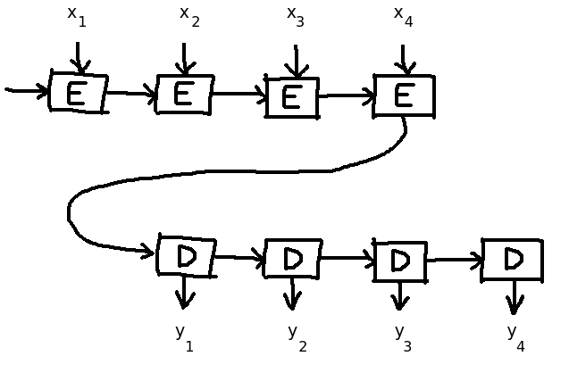

# An Overview of Attention Mechanisms in Neural Networks

Summary:

- Limits of vanilla seq2seq models
- Additive attention
- Multiplicative attention
- Self-attention
- Sources

 

Attention in Deep Learning is one of the most powerful and interesting tools of the last years.
It revolutionized the implementation and the application of seq2seq architectures, and consequently the whole field of NLP.

One of the most fascinating aspects of attention mechanisms is a strong biological analogy, i.e. the way it works is very similar to the way we usually thing about our own attention.
In fact, we can think of it as some sort of “mental heatmap” in which the most important elements of our empirical input are fired up, to the detriment of its less relevant bits. 
The whole point of attention mechanisms is just that: let’s teach artificial neural networks to understand what elements of its input it should care about the most, and what others instead can be overlooked.

 

## Limits of “vanilla” Seq2seq models

Current attention mechanisms come from research on Seq2seq networks, which goal is to transform an input sequence into another (sorry for oversimplifying, but I don’t want to waste your time). 
They are constituted of an Encoder generating a representation of the input sequence, and a Decoder that receives it and produces another sequence as output. 
Before the came of Transformer networks, Seq2seq models use to be the SOTA in important fields of Deep Learning such as NMT, chatbots, text summarization and image captioning.

Their problems are well known: they struggle to process long sequences.

Imagine a typical seq2seq model with LSTM layers:

  

Let’s assume a very relevant bit of information is located far away in the input sequence (let’s say at the very beginning of it). 
The Encoder should generate a representation of the whole input in a single vector, making it very hard for that signal to traverse intact all LSTM cells and reach the layer output. 
That’s why “vanilla” Seq2seq struggle in translating long pieces of text. 
(The introduction of bidirectional Recurrent layers improved significantly the performance of RNNs, but it alleviated the problem rather than solving it.)

Moreover, it’s not how we translate things. 
Imagine someone told you to translate an article from Italian to English: you don’t read the whole text, memorize it, and then say: “Got it! Let me write it all down in English!”. 
That’t not how we do. Rather, we’d constantly check the original and the translation, jumping from one to the other countless times. 

That’s what attention mechanisms is meant to accomplish.

In this post I will review the three main kinds of attention mechanism:
- Additive attention
- Multiplicative attention
- Self-attention

I will explain how they work, and how attention layers can be quickly called or implemented in TensorFlow 2.x.

 

##  Additive attention

It’s the first successful formulation of attention mechanism, proposed by Bahdanau et al. In 2014.
That’s what they did: in a Seq2seq model, between the Encoder and Decoder, the added an Attention block: 
nothing more than a simple feed forward layer that, for each of the steps produced by the Decoder, learns how to distribute attention on the outputs of the Encoder.

Although it seems significantly more complicated than before, there is only one difference.
Between Encoder and Decoder we now have an "Attention block" that at each time step t receives to inputs: the Encoder's output at t, and the Decoder's state at t-1.
These are the elements that the Attention block needs to produce the Decoder's input at t.

More closely, it works like this:

As shown in the picture, at each step the Decoder can “choose what to look at” the most by combining together its last state and the current Encoder output.

This formulation of the mechanism is called *additive* since the attentional output, called *context vector*, is obtained by summing all element-by-element products of Encoder hidden states and attention scores.

Attention allows the Decoder to look at the same time to multiple steps of Encoder sequence, even far back in time. 
In a way, the Attention mechanism plays a role not too different from the one that is played by skip connections in CNNs. 
It represents a “shortcut” for any useful signal present in the input sequence, that doesn’t have to traverse all the layer cells before affecting the output.

Since TensorFlow 2.1, Bahdanau attention is already available among keras.layers as AdditiveAttention(). It requires two outputs [EXPLANATION]

 

## Multiplicative attention

L’attenzione moltiplicativa è stata proposta da Luong et al poco dopo la formulazione additiva.

Miglioramento da parte di Luong et al.
In realtà, non ne è stato proposto un solo tipo, ma diversi: [elenco]

[spiega I vantaggi dell’attenzione moltiplicativa presi da Géron]
Al giorno d’oggi, l’attenzione moltiplicativa viene considerata come superiore alla controparte additiva. Nel lavoro di tutti giorni, quando si parla di generalmente di “attenzione” ci si riferisce alla formulazione di Luong et al.

In fact, not one but three Multiplicative attentions have been proposed:
- make
- list
- formulae

Multiplicative Attention was proved superior in performance, while allowing for faster training at the same time.
Because of this, this formulation of Attention is now considered the standard for Seq2seq implementations, and when we generically refer to "Attention" we mean Luong at al.'s.

In TensorFlow 2, Multiplicative Attention is implemented in keras.layers as Attention() and follows exactly the same syntax of AdditiveAttention().

 

## Self-attention

Since its first applications, attentional models have been so successful to push a group of researchers at Google Brain \[Vaswani et al. 2018\] to abandon LSTM and GRU technology 
and invent a new kind of neural architecture based exclusively on Attention mechanisms.

That was the birth of the **Transformer**.

This architecture has an Encoder and a Decoder, each composed of an optional number of blocks that look more or less like this:

\[IMAGE\]

This architecture is more complex than previous ones (IMHO), and to describe it in detail a whole new blog post would be necessary (actually, I’m working on it). 
In the meantime, I strongly suggest you to read the absolutely excellent The Illustrated Transformer by Jay Alamar, a *must read* post on this topic.

What is most interesting here is the explore the Self-attention mechanism, proposed specifically for the new architecture.

Previous attention mechanisms are all relative, i.e. a Decoder learns to produce an output sequence while paying attention to another sequence (produced by the Encoder). 
The intuition at the basis of Self-attention instead is: let’s teach a Neural Network (or better, a part of it) to pay attention to its most important input parts. 

Struttura dell’auto-attenzione e dei vettori Q V K.

Formula

Even though Self-attention was proposed together with the new Trasformer Network, it could in theory be applied to other architectures as well, such as CNNs and RNNs. 
It has been used in GANs, for example \[\].

TensorFlow 2 does not contain a built-in Self-attention layer (yet?), but Aurelien Géron, in his excellent Hands-On book teaches how to implement it in a very simple and elegant way:

\[CODE\]

Attention is one of the most exciting and 

 

# Sources
- [Bahdanau, D., Cho, K., & Bengio, Y. (2014). Neural machine translation by jointly learning to align and translate. arXiv preprint arXiv:1409.0473](https://arxiv.org/abs/1409.0473).
- [Géron, A. (2019). Hands-on machine learning with Scikit-Learn, Keras, and TensorFlow: Concepts, tools, and techniques to build intelligent systems. O'Reilly Media.](https://www.oreilly.com/library/view/hands-on-machine-learning/9781492032632/). particularly Chapter 16, *Natural Language Processing with RNNs and Attention*.
- [The Illustrated Transformer](http://jalammar.github.io/illustrated-transformer/) by [Jay Alammar](http://jalammar.github.io/).
- [Vaswani, A., Shazeer, N., Parmar, N., Uszkoreit, J., Jones, L., Gomez, A. N., ... & Polosukhin, I. (2017). Attention is all you need. In Advances in neural information processing systems (pp. 5998-6008).](https://arxiv.org/abs/1706.03762)

- Lezioni di DL x Stanford

Other usefuls resources:

- [Attention in RNNs](https://medium.com/datadriveninvestor/attention-in-rnns-321fbcd64f05) is a very nice article, 
it was of great help when I was a complete beginner and wanted to understand the very basics of Attention.
It's all about the Bahdanau mechanism, but its insights can be easily extended to Luong's.

- 
